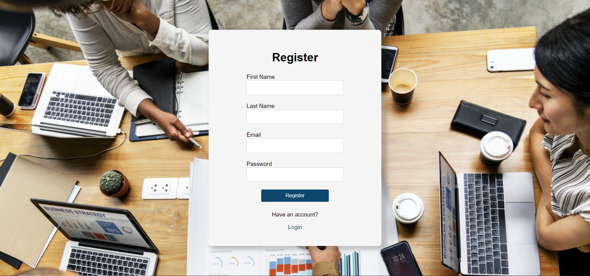
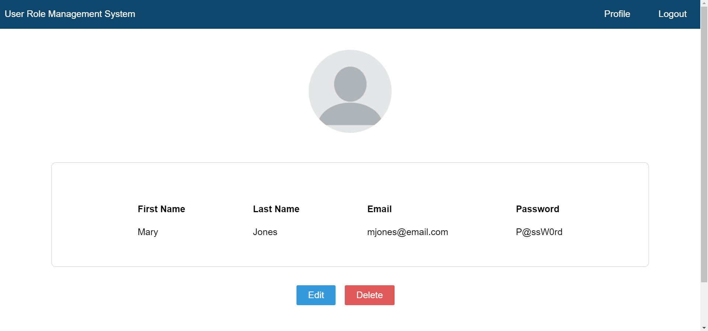
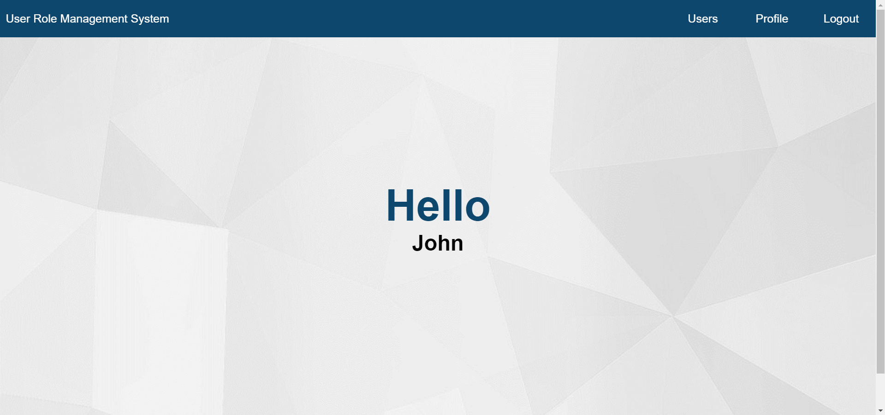
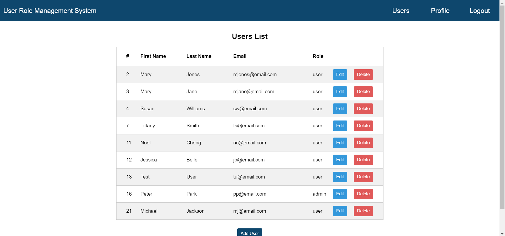

<h1 align="center">User Role Management System</h1>

A full stack web application for user role management.

### Built With

* Node.js
* Express
* MySQL
* Angular

## Setup

### Prerequisites

Softwares used and embedded links to how to install them.
* An Editor (<a href="https://code.visualstudio.com/download">Visual Studio Code</a>)
* <a href="https://www.mysql.com/products/community/">MySQL</a>

### Installation

1. Create a MySQL database and paste the sql code.
2. Pull the repository to VS Code
3. Create a .env file in the server folder with the host, user, password, and database name
4. Open two terminals
5. On one terminal, cd to the server folder and run "npm i"
6. On the other terminal, cd to the client folder and run "npm i"

### Running the Project

1. On the server terminal, run "npm run start"
2. On the client terminal, run "ng serve --open"

## Demo

